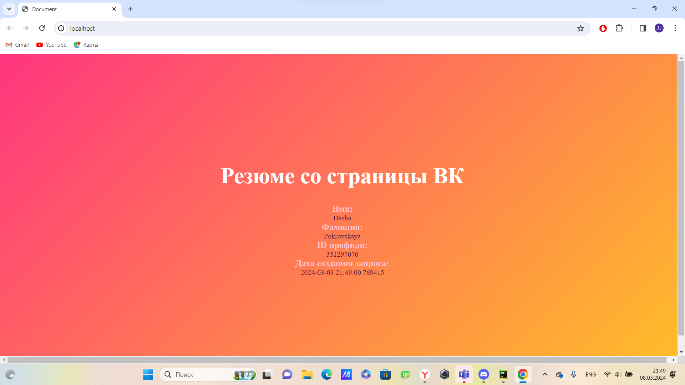

# Программа по генерации резюме со страницы ВК

___

Программа получет на вход данные токена и id пользователя, и по запросу API возвращает и отображает полученные данные на странице html.

### Какие модули для установки нужны:
* Flask
* jinja2
* requests
* datetime

### Как создать виртуальную версию:

1. 'python -m venv venv'
2. windows: "\venv\Scripts\activate" unix: "source ./venv./bin/activate"
3. 'pip install -r requirements.txt'

### Как запустить
1. Добавить свои user_id и access_token в файл .env
2. 'python 1.py'

### Как добавить новые зависимости
1. 'pip freeze > requirements.txt'

# Результат запуска

